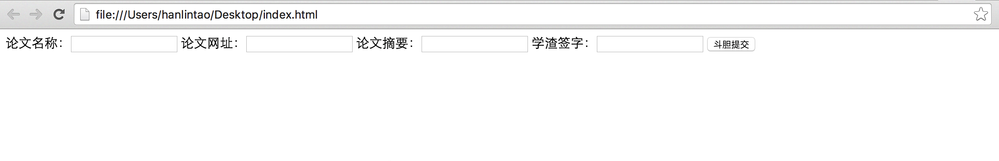

## 文科生学编程

文/韩林涛

文科生也要学编程？！文科生为什么学什么编程？！文科生怎么学编程？！

我想面对上面三个问题，我们身边不缺对编程感兴趣的文科生，可能缺的是文科生学编程的活例子吧。我想写个系列，讲我学了编程后做了哪些事情，希望能用我自己的方式解答上面三个问题。

案例一：一个简单的网站

现如今，我们的生活已经离不开“数据”（Data）了，天天都在与各种各样的数据打交道。数据多了放到一个地方装起来，就变成了“数据库”（Database），要找什么数据就到数据库里面去搜。

互联网的好处在于你做好的数据库放在一个网站里，别人也可以去搜，别人也可以往你的数据库里面去放数据，久而久之，这个数据库就越来越大了，价值也越来越大了，你的网站就会越来越受欢迎

下面我介绍一下怎么做一个简单的数据采集网站，情景如下：

你所在的研究小组有三位并肩作战的小伙伴，每天都担心被导师熊：

      “这个星期看论文了吗？”“这个星期都看了些什么论文啊？”“这种论文还值得看吗？”
      
不好好看论文搞研究，分分钟被导师虐成渣啊！所以你们三个人决定，三个笨学渣顶一个凶导师，准备把三个人看的论文都聚合在一起，一个人看过的论文其他人就不去看了，统统共享到一个地方。

于是，你写了这样一段代码：

    文件名：index.html
    
    代码：

     <!DOCTYPE html>
     <html>
        <head>
            <title>学渣专用论文采集神奇大法宝</title>
        </head>
        <body>
            <form>
                论文名称：<input type="text" name="papername">
                论文网址：<input type="text" name="paperurl">
                论文摘要：<input type="text" name="paperabstract">
                学渣签字：<input type="text" name="zhaname">
                <input type="submit" value="斗胆提交">
            </form>
        </body>
     </html>

这段代码写完之后是什么样呢？如果你想尝试一下的话，可以在电脑桌面上新建一个.txt格式的文本文件，取名叫“index.txt”，然后把以上“代码：”以下的内容粘贴到这个文本文件中，然后把txt改成html，变成“index.html”。这个时候一个网页文件就建好了，可以用任何浏览器打开这个.html格式的文件，打开如下图：

你们仨约定，把这个文件放到网上去，找一个网址，大家都好记的网址，每当一个人看完一篇好的论文，就登录到这个网站上，把“论文名称”、“论文网址”、“论文摘要”、“学渣签字”这四个空填好，然后点击“斗胆提交”，提交到“学渣论文数据库”里。

你们仨一拍即合，这是多么好的一个点子啊！太棒了！酷炫了！学渣变学霸，搞定凶导师，远离象牙塔，走向人生巅峰，指日可待啊！

可是，等等，别急别急，好像有点儿问题：

1. 你们这一共才15行代码，顶多是个网页，还称不上是个“网站”吧？
2. 那四个要填的空摆在一条线上似乎不是很好看呀？
3. 论文摘要那么多字，你就放那么一小个空摆在那里，不太地道吧？
4. 请问，你们的“学渣论文数据库”在哪里？明明什么数据还没有，你们就已经乐开了花，做梦变学霸。你们这个“学渣专用论文采集神奇大法宝”究竟是个什么鬼，拿它来唬谁呢！！

......额......这个......恩......

这几个问题其实也不是那么难回答啦，其实是这样的：

---

1. 文科生学编程：为什么、学什么、怎么学
http://gaokao.chsi.com.cn/gkxx/zybk/201407/20140721/1128916356.html

