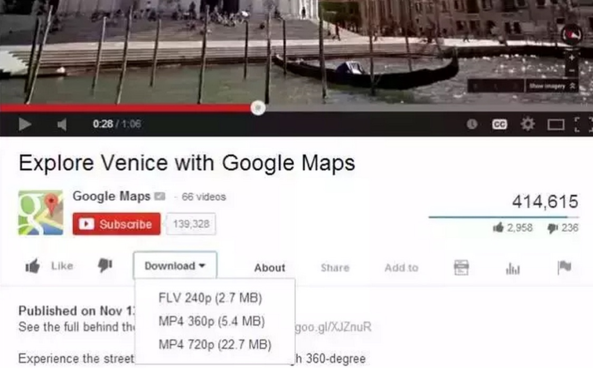

## 如何下载YouTube视频

文/韩林涛

**背景**

无论是学英语找最鲜活的材料，还是寻找自己研究领域内国外的最新进展，我本人都离不开YouTube。身边不少朋友有类似的需求，所以我简单写个短文，介绍一下。

**1 科学上网**

关于如何“翻墙”我真得有话要说

某些国外网站里有不少反动信息，这也是为什么像YouTube这类网站会被屏蔽。然而，个别包含反动信息的网站专门开发了一些软件帮助国内的大众访问这些网站，这类软件俗称“翻墙软件”。有些朋友本来不想去看反动信息，但是为了能访问一些学术网站不得不使用这些翻墙软件，结果不小心就接触到不良信息。所以我向来反对身边的老师同学使用那些会弹出反动信息的翻墙软件，一直以来都推荐大家使用相对更为干净的VPN软件。

因为我使用的VPN软件是收费的，所以我不在这里推荐给大家，我相信您身边肯定有人知道某款VPN适用于您所在的网络，而我推荐的软件不一定适用。在您确定使用VPN前，我想再次提醒各位读者，千万不要使用“自-由-门”这类反动网站提供的软件，千万不要。

**2 选择正确的浏览器**

优选火狐（Firefox）浏览器

我身边的朋友都知道我喜欢向大家推荐谷歌（Chrome）浏览器，不但快，而且简洁，不像国内的某些浏览器那样会捆绑广告、默认设置搜索引擎等等。

但是，在下载YouTube视频这档子事上，谷歌浏览器还真不是首选，因为：YouTube是谷歌公司旗下的产品。谷歌公司早已屏蔽了谷歌浏览器上可以下载YouTube视频的插件。

在百度里搜索“火狐浏览器”，请下载这款浏览器。

**3 下载正确的插件**

插件名叫：Download YouTube Videos as MP4

无论你的电脑是Macbook还是Windows系统的电脑，都可以安装火狐浏览器，均可以在“附加组件”窗口中搜索“Download YouTube Videos as MP4”这款插件。

找到插件后的“安装”按钮，单击之后即可安装。

安装之后重启浏览器插件生效。

**4 下载喜欢的视频**

傻瓜式下载

在科学上网的前提下，打开火狐浏览器，访问YouTube网站，搜索想要的视频后，在视频下方会看到下载按钮，如下图：

我一般会选择mp4格式的视频，如果视频源比较好，可以下载1080p或720p的清晰视频。

单击要下载的视频格式后，火狐浏览器会自动下载。

**结语**

我平时在英语听力课上给同学们准备的视频基本上都是从YouTube上下载的，我一直觉得到了大学再学英语就一定要听真实语速的视频，课本上的许多材料虽然有标准答案和相应的题目，但都是刻意录制的。当然，不是所有专家都同意我的观点。

而在我自己的研究领域内，如果要想了解国外语言服务行业的最新进展，可以到YouTube上去下载一些国际组织（比如TAUS）、国外大学的官网视频，或者一些翻译公司制作的视频，或者一些个人译员自己录制的视频，都对扩展自己的视野有极大帮助。

YouTube的视频播放体验和个别附加功能不知道比国内的某些网站好到哪里去。比如，YouTube可以自动转写视频，生成自动字幕，而且像keepsubs.com这类网站还可以直接下载YouTube上的字幕，用于自学。一些英语视频如果我们自己听不懂或听不清楚，可以直接看机器生成的自动字幕，一般情况下都能识别正确。

我上大学那会儿，一接触到YouTube就着了迷，发现通过这个网站能接触到那么多鲜活的英语学习材料，而现在的同学们和行业里的同仁们却只能在优酷上看到自制搞笑的娱乐节目。幸哉？不幸哉？

