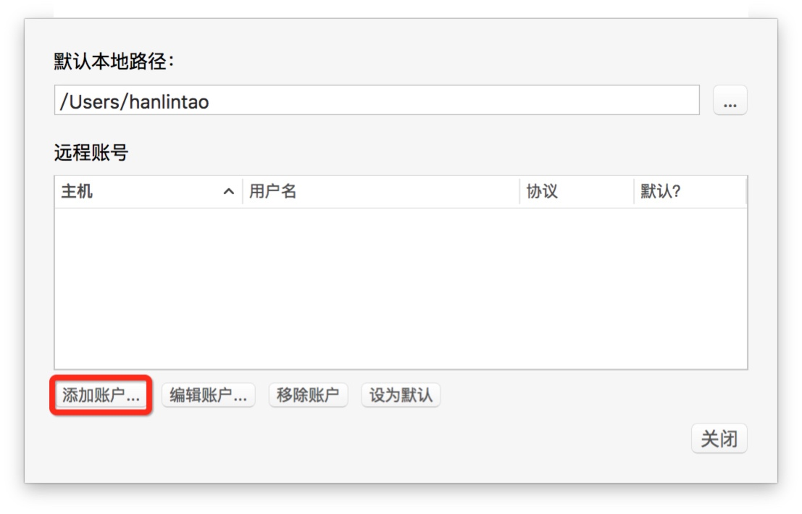

**背景**

前几天偶然发现国内一些程序员也在做翻译。他们中的有些人正在使用计算机辅助翻译软件（CAT）做翻译，但他们并没有使用现在翻译专业学生正在学习的各种收费的专业软件，而是用了一款叫做OmegaT的开源免费的CAT软件，并且能够实现多人协作。

他们之中还有一些人做翻译时并没有使用CAT软件，而是使用了一种叫做Git的工具，也实现了协同翻译，而且有个新闻曾经还比较火，[《协同写作的力量——中国开发者 9 天完成《Swift 语言》中文版》](http://36kr.com/p/212811.html)，这条新闻 “介绍了 GitHub 上开源翻译《Swift 语言》这个项目，发起者是一个 90 后的大学生，整个翻译团队在 9 天内完成了近 670 页的 Swift 语言文档翻译工作。”

我对上面这两种程序员做翻译的现象都非常感兴趣，我自己研究的领域本身就包括计算机辅助翻译，所以就打算把两类程序员使用的工具结合一下，看看能做出什么来。在正式开始做测试前，我在网上搜集了一些国外程序员以及某位台湾同胞的教程，链接在本文后面，也供大家参考。

下面我就开始介绍如何使用开源软件免费实现多人协同翻译。

## 一、“使用开源软件免费实现多人协同翻译”是什么意思？

如果看完上面的背景介绍，还能继续读到这里的，想必也是跟翻译打交道的读者了。你心中可能有这个疑问，“使用开源软件免费实现多人协同翻译”是什么意思呢？

我可以这样简单解释一下：

“使用开源软件”意味着我在这个教程中使用的软件是不花钱的，而且还是正版的，是通过正规渠道下载的，这就是“开源”（opensource）的意思，“源”是“源代码”（source code）。

“多人协同翻译”的意思是多个人可以同时翻译一篇文章，你虽然在自己的电脑上翻译你那部分，但是你不用切换软件页面、不用把软件关闭再打开，只需要边翻译边保存，就可以立刻看到你的小伙伴翻译的内容。你的小伙伴添加了一条术语你可以看到，某句话如果已经被你的小伙伴翻译了，你就不用翻了，软件自动产生译文。

所以啊，“使用开源软件免费实现多人协同翻译”的意思就是好几个人可以不花一分钱就能用这个软件同时翻译一篇文章，这就意味着当客户找你做比较紧急的稿件时，你可以找好几个人和你一起做，而且你还不用再花时间去整合不同人的稿子，在一个页面里就能解决；这个软件是免费的，你也不用给你的小伙伴去破解；这个软件操作简单，基本上不需要培训。我想给大家展示的就是这么个玩意儿。

（关于“协同”和“开源”，我之前还写过一篇文章，在本书的“简言之【简而言之】一章中”，链接在此：[翻译教育的创新——协作和开源](http://www.plaintalks.com/content/PlainTalks/Jianeryanzhi/4.html)）

## 二、来，不花钱，一起干吧

意思我传达到了，活儿要开始做了，接下来我开始说怎么实现。

**第一步：下载所需软件**

软件一：OmegaT

下载地址：http://www.omegat.org/zh_CN/downloads.html

本软件可以供苹果系统电脑、Windows系统电脑、Linux系统电脑使用，所以除了iPad这类平板电脑无法安装外，其他的绝大多数电脑都可以安装。本文以苹果系统电脑为例。

安装之后的截图如下：

软件二：SourceTree

下载地址：https://www.sourcetreeapp.com/

前面我提了好几次“git”、“github”，但都没有解释，现在我要下载的这个工具就是一个“git”工具，我稍后再解释，大家先看我的介绍。

安装之后的截图如下：

**第二步：注册所需帐号**

网站名称：Git@OSC

网站地址：http://git.oschina.net/

这是个什么网站呢？现在我觉得我得先介绍一下什么是“git”了。

首先，“git”目前的意思是“用来快速高效处理各类项目的免费开源分布式版本控制系统”，但它的实际意思是：“a dumb, annoying, or generally unpleasant person”（蠢笨的、讨厌的、不招人喜欢的人），这是个英国的脏话，用来骂人是“饭桶”的词儿。

“git”是人为开发出的一套计算机软件，这套软件的功能是管理同一个项目的不同版本，比如你用Word写了个文档，交给好几个人去改，他们改完之后传给你，你怎么确保每个人的修订最终都能以你希望的方式整合到最终的版本中呢？

这事儿可以人为操作，也可以靠软件来快速高效的执行，于是现年45岁的芬兰裔美国人Linus Torvalds（林纳斯·托瓦兹）在他36岁的时候开发了这个软件。但是，人家22岁还没大学毕业的时候开发了一个叫“Linux”的操作系统，这个操作系统的名字就是根据他自己的名字“Linus”来命名的，而他觉得自己是个“git”，所以又给自己开发的这个版本控制系统取名叫“git”。他还在一个文档中写道：“git”有很多意思，取决于你的心情......这个软件崩溃的时候它的意思是“"goddamn idiotic truckload of sh*t"”（我就不翻译了哈）。（[来源](http://www.quora.com/What-is-full-form-of-Git)）

就是这样一个版本控制软件，一经出现后就受到不少程序员的追捧，并开发了各种基于它的软件，这类软件都叫做git软件，本身这个软件是一坨代码，但是为了方便操作又有人开发了图形化的界面，之前大家下载的软件二“sourcetree”就是其中一款，我自己觉得比较好用，所以就推荐了，其实还有其他的。

git在国外风生水起，在我国国内也有很多程序员使用，为了让更多人使用，一家叫做“开源中国”的网站就做了一个叫做“Git@OSC”的代码托管社区，意思是：你把你写的代码放到我的服务器上，高端一点就是放到我的云上，然后你就可以用你喜欢的git软件来管理代码的版本。

这句话放在语言服务圈或者翻译圈就是这个意思：你在我的网站注册一个帐号，把你要翻译的文章放在我的云服务器上，你的译文可以实时和你的电脑上的译文同步，你就尽管翻译，同步的事情我来完成。多邀请几个小伙伴来注册，加入你的翻译群，一家做翻译，赚钱乐无边。

我再补充一句，这是个程序员的网站，你不用担心你的译文放上去会被人看到、下载、传播，他们不care的，他们只care代码。

## 三、废话好多，可以开始进入正题了吗？

可以了，概念基本上介绍完了，虽然前面这部分差不多写了2000来字，但还是希望能把这事儿的原理说得直白一些（实际原理其实很复杂，但译员不需要care代码的。）

 **第三步：在Git@OSC上创建项目**

我在上一步中注册的帐号是：pkucater@gmail.com 在屏幕中显示的用户名是PKUCATer，密码是：·············，在后文中的截图里大家好辨识，这个角色就是翻译团队项目经理或者翻译工程师的角色。

注册完成后，点击创建项目：

然后填写项目信息：

项目创建完成后看到的界面如下：

在右上角可以看到该项目的版本库网址，也就是要从CAT软件OmegaT中登录这个云服务器时应该输入的云服务器的网址，我新建的这个项目的地址是：https://git.oschina.net/hanlintao/CSDN.git ，如图：

现在我就以翻译团队项目经理或翻译工程师的身份创建了一个“翻译项目云服务器”，这个服务器的地址是：https://git.oschina.net/hanlintao/CSDN.git , 项目经理的登录邮箱是：pkucater@gmail.com ，登录密码是：·············。只不过，现在这个项目是空的，里面什么翻译项目文件都没有，只有一个叫 README.md 的默认创建文件，也是空的，毕竟这是一个给程序员开发的管理代码的网站平台，不是给译员用的，所以没有任何跟翻译相关的文件。

在程序员的语境里，我们刚才创建的“翻译项目云服务器”用行话讲叫“仓库”（Repository）或者“Git 仓库”。

**第四步：用Git工具将本地项目文件同步到“翻译项目云服务器”中**

这一步是非常关键的一步，虽然我们刚才创建了一个空的“翻译项目云服务器”，但是我们需要先用Git工具Sourtree把那个空的服务器下载到本地电脑的一个空文件夹中，这样才能实现云服务器和本地文件夹的同步，也就是网络空间和本地空间的同步。

在程序员的语境里，我们刚才创建的“翻译项目云服务器”下载到本地的空文件夹的行为用行话讲叫“克隆”（Clone）。

所以，下面打开SourceTree，如图：

点击“+新仓库”，选择“从URL克隆”，这里的URL就是我们上面提到的“云服务器地址”：https://git.oschina.net/hanlintao/CSDN.git 

在弹出的窗口中，“源URL”处填写自己的“云服务器地址”，我的是：https://git.oschina.net/hanlintao/CSDN.git

在“目标路径”处，填写一个你在本地电脑上创建的新文件夹，我创建了一个叫做“CSDN”的文件夹，位于“/Users/hanlintao”文件夹下，所以我填写的是“/Users/hanlintao/CSDN”，不同电脑是不一样的，可以点击后面的“···”按钮来选择，不用自己输入。

在“名称”处，自动填写上刚才选择的空文件夹的名字，我的是“CSDN”。

输入完上面这三个空之后，点击下方的“高级选项”，在“检出分支”处选择“master”。

以上空填完后如下图：

然后点击“克隆”按钮，开始从“云服务器上”克隆文件。

在这个过程中，如果会弹出一个对话框提示你输入用户名和密码，这里要输入就是我们之前注册时使用的邮箱名和密码。

如果没有弹出，请前往下图中点击右上角的“齿轮”按钮，出现弹出框后点击“设置”，然后手动输入，各步骤截图如下：

以下是“克隆”操作前后“云服务器”和“本地文件夹”的变化对比图：

“云服务器”克隆前：

“云服务器”克隆前：

结论：没有发生变化

“本地文件夹”克隆前：

“本地文件夹”克隆前：

结论：多了一个 README.md 文件

通过对比可以发现，“克隆”已经成功，云服务器没有发生改变，因为本地文件夹并没有上传任何文件上去，本地文件夹多了一个 README.md 文件就意味着已经与云服务器同步。

**第五步：用OmegaT在本地电脑文件夹中建立翻译项目**

接下来，就要打开OmegaT了。打开之后再点击左上角的“项目”--“新建”，如图：

这时，请不要在“CSDN”文件夹下创建项目，而是在另外一个文件夹中创建。

在这个创建的过程中你可以选择源语言、目标语言、添加待译文件等，详细介绍太占篇幅，所以大家看教程即可，五分钟就可以学会。

创建完项目后，文件夹中会出现以下文件及文件夹，如图：

接下来，请把新文件夹里面的内容剪切出来粘贴到“CSDN”文件夹下，确保“omegat.project”这个文件位于“CSDN”这个文件夹下，否则后面会有麻烦。这一步非常重要。

**第六步：用Git工具同步OmegaT创建的翻译项目到云服务器中**

OmegaT翻译项目创建完成，并将创建好的文件剪切粘贴到“CSDN”文件夹后，再次打开SourceTree窗口，如图：

你会发现，在一个名叫“未暂存”的板块里出现了刚刚我们创建的OmegaT项目文件：

接下来的操作会非常重要，你需要：勾选“未暂存文件”左侧的白方框，勾选后，所有文件会立刻移到上方的“已暂存文件”板块；然后在下方填写一些这次提交内容的简要描述，勾选“立即推送变更到orgin/master”左侧的白方框，并点击最右下角的“提交”按钮：

点击提交后，会短暂出现一个标有“Commiting”（提交）的对话框：

然后SourceTree的界面会显示：“没什么可提交的”：

现在，我们再到Git@OSChina的界面去看一眼：

我们发现，部分OmegaT的文件已经上传上来了，其他文件夹如“dictionary”、“glossary”等之所以没有上传上来，是因为这些文件夹是空的。一但里面有了新的文件，SourceTree中会提醒有新的“未暂存文件”再“提交”一次即可同步到云服务器上，这个操作需要由翻译项目经理来操作。

**第七步：器已利，工可以开始善其事了**

现在，借助Git工具SourceTree我们已经成功将OmegaT与Git系统Git@OSC建立起了同步关系，完成了云平台的搭建。

熟练之后，上述步骤只需要五分钟即可完成，你没有看错，只需要5分钟！

下面译员就要登场了，而本文也要接近尾声了，因为没什么可以写的，译员部分的操作相当相当简单！

作为即将加入协作项目的译员，需要干三件小事：

第一，下载软件：只需要下载OmegaT即可，不需要下载SourceTree，这是项目经理才需要用的。

第二，注册帐号：注册Git@OSC帐号，注册完成后记住登录邮箱和密码，然后把用户名告诉项目经理。

这两件事做完，先稍等片刻，项目经理需要将你加入项目，方法如下：

项目经理再次登录到自己的Git@OSC帐号中，点击项目界面右上角的“管理”：

在“项目成员管理”处选择“开发者”：

然后点击“添加成员”按钮，输入译员的用户名，然后将其角色设置为“开发者”即可。

一旦添加完成，译员就可以登录项目了，登录方法如下：

打开OmegaT后，在左上角点击“项目”--“下载团队项目”：

在弹出的窗口中，输入项目经理告知的“版本库网址”，即“云服务器地址”，然后新建一个本地文件夹用以储存从云端下载的翻译项目。

点击“确定”后会自动弹出一个“认证”窗口，在这个窗口中译员输入在Git@OSC上的邮箱和密码：

点击“确定”，译员要做的第三件事就完成了，接下来翻译项目就会自动下载到本地，译员可以马上开始翻译了。

协同翻译即刻开始，译员可以根据项目经理的要求翻译指定句段，每次翻译完后按一下“Ctrl+S”键保存，新增的改动会立刻同步到云服务器，如果不按，那么OmegaT默认每3分钟自动保存一次，这个可以修改为每1分钟保存一次。

一旦译员翻译的内容上传到云服务器，项目经理或者其他译员每次按“Ctrl+S”保存或者OmegaT自动保存后，云服务器端的所有内容（翻译记忆库、译文、术语库、翻译笔记）都会同步下来。

基于开源软件的免费协同翻译就这样实现了，不花一分钱，不用盗版，项目经理稍微麻烦几分钟，译员端全部傻瓜操作。

结语

我不知道会有多少读者会坚持看到这里，这篇帖子确实很长，写了大半天，我已尽力“简而言之”了，希望全篇帖子会对译员、翻译公司、高校师生等有所帮助。如果这篇文章所讲述的方法给你节省了时间、成本、人力，欢迎你前往本书的[捐赠页面](http://hanlintao.gitbooks.io/plaintalks/content/Donation.html)给我捐赠，支持我的文章。

最后，补充几点：

1. OmegaT 可免费加入微软的机器翻译系统，整合后可以进行译后编辑。
2. 本文尚未涉及OmegaT的具体操作，如深入研究其功能可大大发挥这款免费CAT软件的功用，提高协同翻译的效率。

---

参考资料：

1. 如何用 OmegaT 協作 LibreOffice 指引手冊翻譯
http://libreo-zht.blogspot.nl/2015/04/omegat-libreoffice.html

2. Sharing a project with OmegaT and Subversion
http://omegat.wikia.com/wiki/Sharing_a_project_with_OmegaT_and_Subversion

3. Introduction to the Team Project feature in OmegaT
http://www.proz.com/forum/omegat_support/240607-introduction_to_the_team_project_feature_in_omegat.html

4. OmegaT Team Projects
http://ob.nubati.net/ditundat/omegat/en/OmegaT_Team_Projects