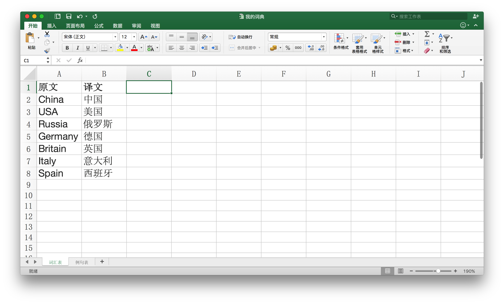
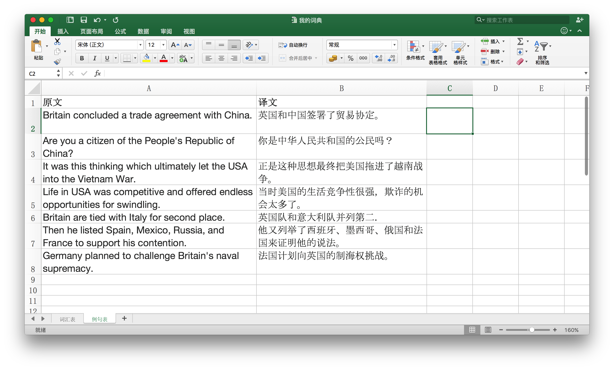
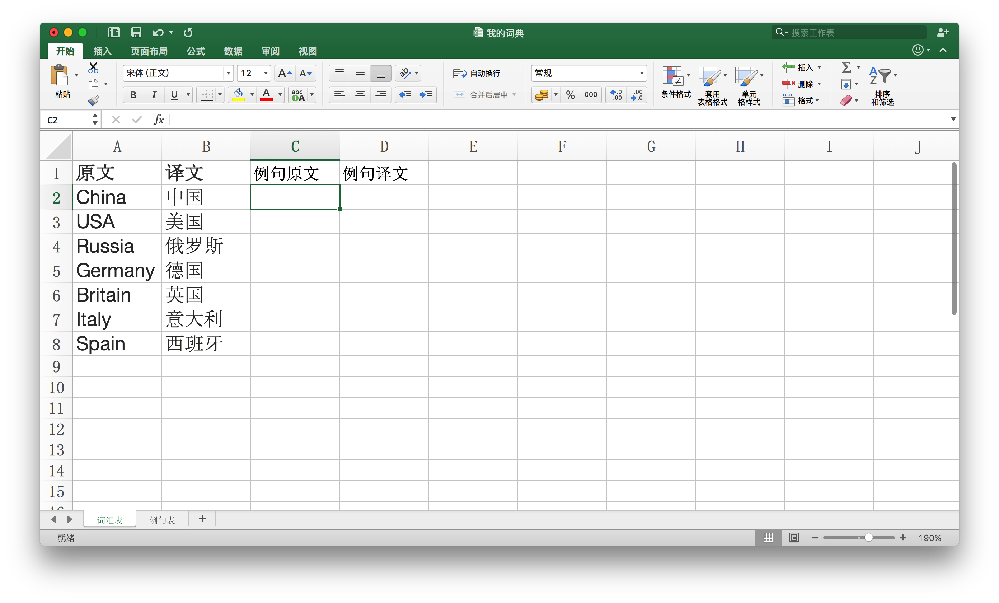
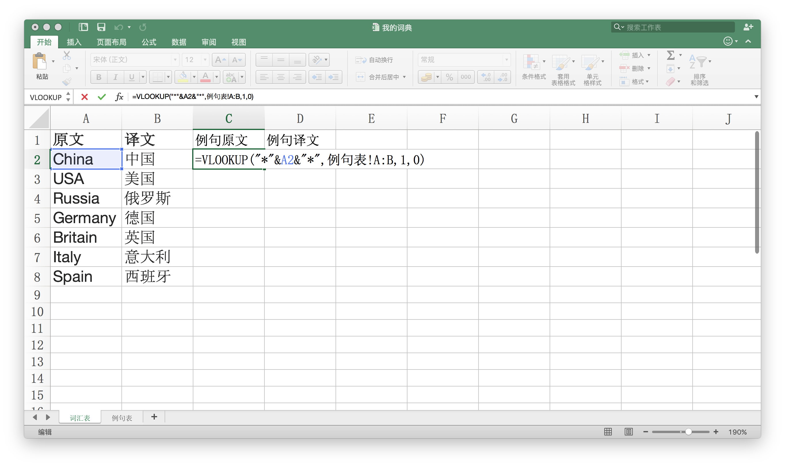
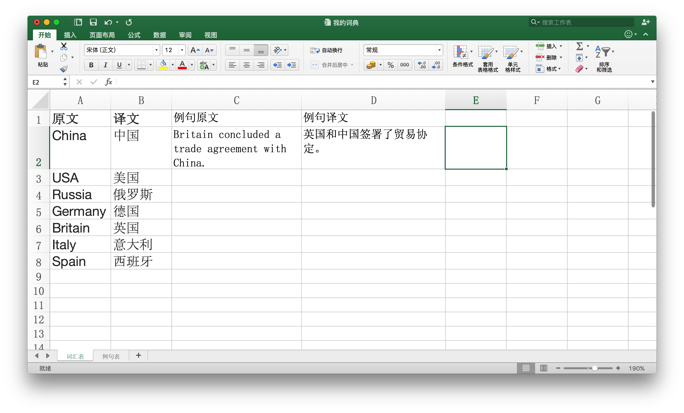
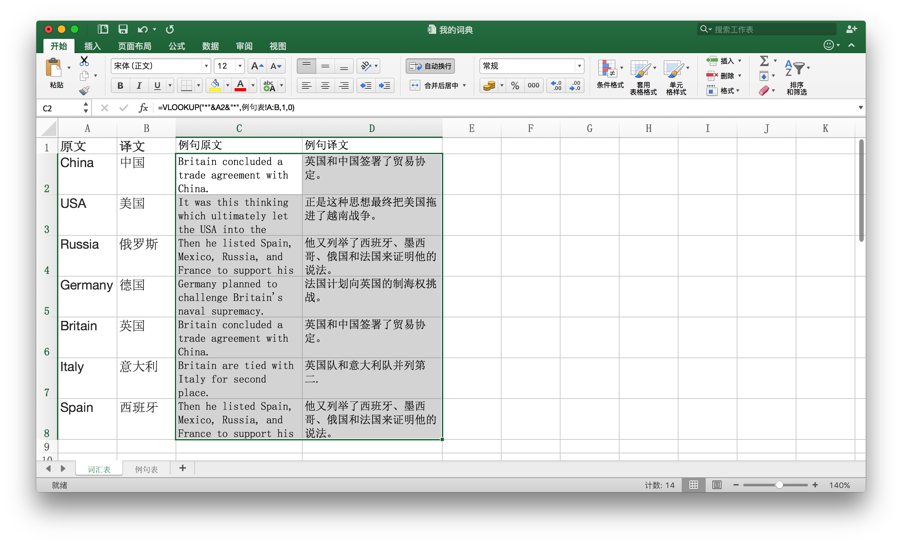

## VLOOKUP函数在翻译实践中的应用——创建双语词典


**文/韩林涛**

你是否曾经有过这样的设想：当你搜索某一个单词的时候，包含这个单词的所有例句都能展示出来供你参考？

如果说用编程的方法你不会实现的话，那么在这篇文章中我为你展示一个用Excel来实现的方法，而实现的手段就是VLOOKUP函数。

我先不解释VLOOKUP的定义，先看一下怎么使用：


## 一、在那山的那边海的那边有两个数据表


一个数据表是这样的：

词汇表

| 原文 | 译文 |
| -- | -- |
| China | 中国 |
| USA | 美国 |
| Russia | 俄罗斯 |
| Germany | 德国 |
| Britain | 英国 |
| Italy | 意大利 |
| Spain | 西班牙 |

另一个数据表是这样的：

例句表：

| 原文 | 译文 |
| -- | -- |
| Britain concluded a trade agreement with China. | 英国和中国签署了贸易协定。 |
| Are you a citizen of the People's Republic of China? | 你是中华人民共和国的公民吗？ |
| It was this thinking which ultimately let the USA into the Vietnam War. | 正是这种思想最终把美国拖进了越南战争。 |
| Life in USA was competitive and offered endless opportunities for swindling. | 当时美国的生活竞争性很强，欺诈的机会太多了。 |
| Britain are tied with Italy for second place. | 英国队和意大利队并列第二. |
| Then he listed Spain, Mexico, Russia, and France to support his contention. | 他又列举了西班牙、墨西哥、俄国和法国来证明他的说法。 |
| Germany planned to challenge Britain's naval supremacy. | 法国计划向英国的制海权挑战。 |


## 二、一键生成自己的“词典”


有没有想过有一天能生成这样的“词典”：

| 原文 | 译文 | 例句原文 | 例句译文 |
| -- | -- | -- | -- |
| China | 中国 | Britain concluded a trade agreement with China. | 英国和中国签署了贸易协定。 |
| USA | 美国 | It was this thinking which ultimately let the USA into the Vietnam War. | 正是这种思想最终把美国拖进了越南战争。 |
| Russia | 俄罗斯 | Then he listed Spain, Mexico, Russia, and France to support his contention. | 他又列举了西班牙、墨西哥、俄国和法国来证明他的说法。 |
| Germany | 德国 | Germany planned to challenge Britain's naval supremacy. | 法国计划向英国的制海权挑战。 |
| Britain | 英国 | Britain concluded a trade agreement with China. | 英国和中国签署了贸易协定。 |
| Italy | 意大利 | Britain are tied with Italy for second place. | 英国队和意大利队并列第二. |
| Spain | 西班牙 | Then he listed Spain, Mexico, Russia, and France to support his contention. | 他又列举了西班牙、墨西哥、俄国和法国来证明他的说法。 |

做完翻译后如果想把自己积累的术语原文和译文与包含了这些术语的例句放在一起做成上面那个词典，那么就要用到VLOOKUP函数了。而且只需要写一行函数，按一下鼠标就可以生成。


## 三、操作方法


第一步：将词汇表和例句表分别至于一个Excel表的两个工作表（Sheet）里，如图：

Sheet1：词汇表



Sheet2:例句表



第二步：撰写VLOOKUP函数

在词汇表中新建“例句原文”和“例句译文”两列，如图：



在“例句原文”下方的表格填写下列函数：

    =VLOOKUP("*"&A2&"*",例句表!A:B,1,0)
    
如图：



在“例句译文”下方的表格填写下列函数：

    =VLOOKUP("*"&A2&"*",例句表!A:B,2,0)

然后得到下图中显示的结果：



从这张图可以看出，通过这个函数成功的将包含“China”这个词的原文和译文匹配到了“例句原文”和“例句译文”这两列中。如果希望全部词汇表都呈现这样的效果，只需要用鼠标选中“例句原文”和“例句译文”下方的两个单元格，然后使用下拉功能，拖动到最底下即可，如图：




## 四、函数解析


我刚才使用的函数看起来复杂，但实际上有非常清晰的逻辑：

    =VLOOKUP(我要查找术语原文，在例句表中查找，给我返回对应例句表第一列中的数据，我希望进行精确匹配)

从上面这个解释中可以看出，如果想正确使用这个VLOOKUP函数，需要在后面的括号里进行四个设置：

第一个设置：```lookup_value```

这个设置对应的内容是一个选中的单元格，比如在我刚才写的函数中，我想查找的术语原文是“China”，而“China”所在的单元格是“A2”。那你可能想问，为什么我写了一个那么复杂的```"*"&A2&"*"```？这是因为，在例句表里没有一个例句的原文内容就是“China”这一个单词，所有例句都是完整的句子，这里的```*```是一种通配符，可以匹配零个或多个任意字符，在“China”前面加个星号，用英文引号括起来，在其后面也加个星号，用英文括起来，就表明我希望在查找时“China”前面可以有任意个字符，后面也可以有任意个字符，这样才能找到包含“China”的句子。至于那个```&```符号，这个符号起到连接作用，把前后两个引号分别连接到我想查找的词汇两边。

第二个设置：```table_array```

这个设置对应的是查找的范围，比如我想找“China”，那么我去哪里找呢？我可以在Excel表里进入到“例句表”这个工作表中，选中A列和B列，也就是“原文”和“译文”两列，这样就选中了一个要查找“China”的区域。如果不用鼠标选，而是自己敲代码，那么就写```例句表!A:B```，工作表的名字后面跟上一个英文的叹号，再紧跟A、英文冒号和B，这样也可以把这个区域表示出来。

第三个设置：```col_index_num```

在我选择我例句表的A列和B列后，A列就是第1列，B列就是第2列，我希望能够在第1列中去找“China”，然后把找到的例句显示到前面那个词汇表里，也就是我想显示：第1列中包含了“China”的句子，所以我在第一个VLOOKUP函数中的第三个位置写了“1”，把从第1列中找到的句子显示在“例句原文”一列中，相应的，我在第二个VLOOKUP函数中的第三个位置写了“2”，也就是把从第2列中找到的句子显示在“例句译文”一列中。

第四个设置：```[range_lookup]```

第四个位置只有两种状态：0或者1。0表示精确匹配，1表示模糊匹配。0也可以用FALSE来表示，1也可以用TRUE来表示。

有读者可能会问，用星号加“China”组合在一起找明明是模糊匹配，怎么能是精确匹配呢？这个稍微绕一点，模糊和精确是针对查找数字的时候来说的，比如查找40，精确匹配就是40，模糊匹配是比40小的数字里最大的那个数字，而针对文字的匹配则不是这样了。这里实在无法理解就当是一个基本知识吧，我也不太细的解释了，简单说就是精确匹配跟```"*"&A2&"*"```符合的句子，如果一个句子里没有“China”，哪怕是chin或者hina这样的词都不会匹配出来。

**结语**

经过上面的解释，你大概明白VLOOKUP函数的使用方法了吧？如果不明白，也不要紧，看完我说的，再去看下面这个视频，讲得更专业。根据我听到的绝大部分经常用Excel的朋友的说法，VLOOKUP函数是进入职场必学必回的一个Excel函数，由此可见这个函数的重要性，所以，还是努力掌握吧！
<html>

<embed src="http://player.youku.com/player.php/sid/XNTY5NDc3NzIw/v.swf" allowFullScreen="true" quality="high" width="480" height="400" align="middle" allowScriptAccess="always" type="application/x-shockwave-flash"></embed>

</html>
 


