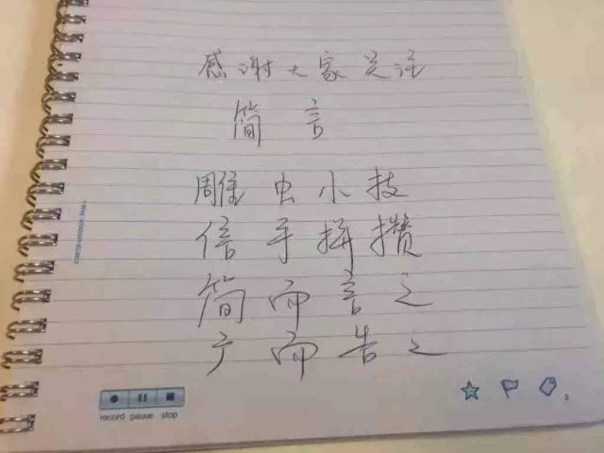

背景

智能笔 Livescribe 3

本文的主角就是上图中大家看到的这款样貌有一点点怪异的大胖笔：Livescribe 3。它是一支神奇的智能笔，售价大约1300元人民币，本文主要介绍它的基本功能，至于如何使用，就看各位的想象力了。

1 这款智能笔能干什么？

这支笔能同时记录笔迹和声音。

某科技媒体是这样介绍这支笔的：“Livescribe 3智能笔的出现，非常好地解决纸质记录与移动设备之间的信息化互通问题，Livescribe 3智能笔在两种方式间搭建起一个桥梁，让我们体验书写与绘画的带来快乐的同时，也能将这些文字图画通过信息化终端进行分享，使用配套的Livescribe+应用软件，写在纸上的内容会实时显示在你的平板电脑或智能手机上，从而让信息沟通和保存更加方便。”（雷科技）

通俗一点说这支笔干了这样一件事儿：开会或上课的时候，如果我用这支笔来做笔记，我在纸上写的每一个字都会实时传输到iPad或iPhone或Android手机上，不用自己再拍照留存；与此同时，这支笔会像录音笔那样，把当时会场或课堂的声音也录制下来；当你在iPad上用手指点击笔记上的某个字儿时，iPad会开始播放你写这个字儿时领导或老师的讲话内容。

2 这支笔能在纸上写字吗？

能，可以，没问题，放心

笔记本外观：定制的纸质笔记本

这支笔内置一根碳化钨圆珠笔芯，所以可以看成就是一支高级的圆珠笔。买这支笔的同时，包装盒理会附赠一本纸质的笔记本，这个笔记本是定制的，用完之后，需要去产品官网下载模板自己用彩色打印机打印，如果自己购买的话，大约20元人民币一本。

书写姿势：毕竟还是一支笔

在纸质笔记本上书写时，除了感觉这支笔稍微厚重（胖）一点外，没有特别的异样，书写手感不错。仔细观看这支笔的细节，会发现：在笔尖的旁边有一个“洞”，“洞”里面有个跟摄像头一样的镜片。这其实是红外线高速照相机。再仔细观看纸质笔记本的细节，会发现：白色的笔记本上其实密密麻麻分布了好多小点。我们用笔书写时，照相机会捕捉笔迹和这些点的关系，传输到iPad等电子设备上后笔迹就可以复现了。

红外线高速照相机：有点007特工的感觉

笔记本上的点阵：需仔细观看才能辨识

3 什么样的设备可以支持？

不是所有设备都配得上它

官方说明书写道，Livescribe 3要求使用下列运行iOS7的设备：iPhone 4S或更新的版本；iPad 第三代或更新版本；iPad mini或更新版本。说明书并没有写Android设备，但已经证实的是，部分系统版本比较高的Android设备才能支持，所以如果你的手机或平板版本不符合以上要求，请慎重购买，否则买回来的不是“智能笔”，而是一支1300元的“大胖笔”。

之所以要使用以上版本的设备，是因为这支笔本身没有录音功能，需要通过蓝牙借助其他设备来录音，设备上安装Livescribe的软件后，才能将笔记通过蓝牙进行传输。因此，蓝牙版本比较低，系统配置比较低的设备都无缘这支笔了。

4 这支笔究竟有什么用？

似乎并没有什么太大的......然而......

在本文一开始就介绍了这款智能笔的主要用途，这支笔主要用于开会经常走神的职场人士或上课经常睡觉的在校学生，当然对于我们这种教英语听力和一些教口译的老师，这支笔还有一定的科研价值。

如果你不希望重要会议错过领导的讲话重点，那么可以借助这支笔来帮助你快速定位到某条笔记对应的领导讲话录音；如果你上课的时候担心错过老师的某一条奇葩语录，也可以用这支笔来做课堂笔记。

对于语言学习者而言，尤其是口译学习者，这支笔的好处在于可以检测自己做听力练习时为什么有些单词没有听出来，或者可以在做完口译练习后回顾自己的笔记是否能对应上讲话人的发言，是否有遗漏的细节。

笔记本上的字迹

上图是iPad上的字迹，绿色表示录音播放至此结束

结语

1300元的智能笔其实还有很多有意思的细节，比如用智能笔点击纸质笔记本上的“录音”图标就可以开始录音；手写的文字可以转换成可编辑的文本；记录完的笔记可以一键发送至印象笔记或OneNote；这支笔倒过来是一支可以在iPad上书写的电容笔......电子设备与纸质媒体的交互从未这样让人觉得神奇。不同的职业、不同的兴趣都会与这支笔发生奇妙的化学反应，产生更多新奇的想法。

在网上搜索“Livescribe 3 评测”能够看到更多这款智能笔的使用感受。