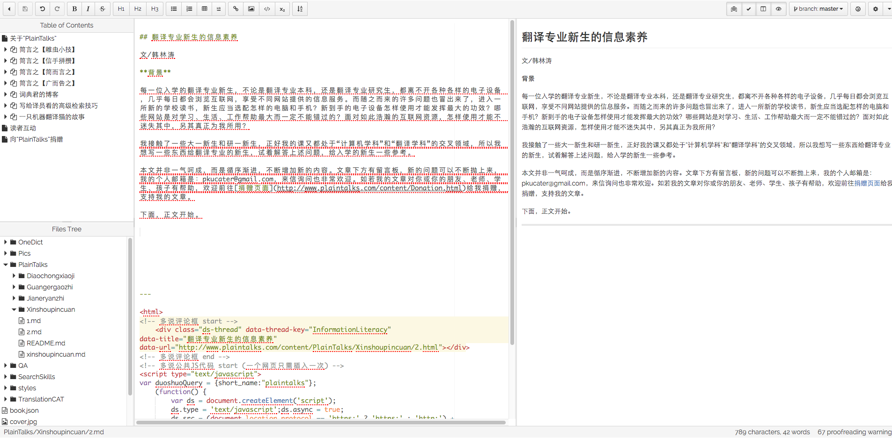

各位读者，

如果大家在看完本书的文章后愿意和我继续交流，可以在下方留言，或者给我发送邮件：pkucater#gmail.com （#替换成@）

**Q：你的电子书是怎么做的？**

**A：**这个电子书是在国外一个叫做Gitbook的网站做的，网站地址：https://www.gitbook.com/ 注册之后我还做了几件事：

**1. 撰写文章**
  
  Gitbook有自己的一套撰写文章、设置文章结构的方法，注册之后可以看教程，不难。下图是文章撰写的页面截图：

  

**2. 注册域名并转发到**

   我在万网上注册了域名，然后上传身份证简单认证了一下，就把域名转到Gitbook里写的这本书上了，它原来的域名很长，用了自己的域名后更好记。
   
经过以上两步，电子书就做出来了。

**Q：想深入研究本地化工程的话，您认为应该在哪些方面下功夫呢？有哪些项目可以比较好地锻炼本地化工程人员？

A：**首先，对于第一次接触“本地化”或者“本地化工程”的读者，可以看一下“[本地化公司和翻译公司的区别](http://www.plaintalks.com/content/PlainTalks/Jianeryanzhi/2.html)”这篇文章，区分一下“本地化”和“翻译”这两个概念。

然后再看“本地化工程”指的是什么。我手里有这么两本关于“本地化工程”的书，分别是：

| 书名 | 作者 | 参考价格 |
| -- | -- | -- |
| [《本地化与翻译导论》](http://item.jd.com/10500505.html) | 杨颖波、王华伟、崔启亮 | 24.3元 |
| [《翻译与本地化工程技术实践》](http://item.jd.com/10500504.html) | 崔启亮、胡一鸣 | 22.4元 |

我在学本地化工程的时候先看的这么两本教材，同时还上了对外经济贸易大学崔启亮博士的课，逐步了解本地化的概念和本地化工程涉及的方方面面。

我觉得，如果不看书的话，脑子里也许只有一两段模糊的关于本地化工程的文字和些许几幅模糊的画面，但是看完教材之后，能够获得一张系统结构清晰的网。有了基础知识的铺垫后，知道自己有哪些知识储备上的不足，然后再逐一去自学弥补。

在看完教材弥补知识不足的过程中，可以先尝试对一些开源的软件、游戏、网站进行本地化，参与的方式有很多，比如加入汉化小组、了解北京大学软件与微电子学院研一学生本地化课程的课下作业、自主寻找案例等等。如果看完书后比较有自信，还可以关注网上关于本地化公司招聘的信息，尝试应聘本地化公司的工程类职位，在实践中检验自己的知识。

我想，以上最核心的是先填充自己的知识空白，自学一些本地化工程知识，然后实践的机会应该会很快来临。

---

<html>
<body>

<!-- 多说评论框 start -->
	

<!-- 多说评论框 end -->
<!-- 多说公共JS代码 start (一个网页只需插入一次) -->

<!-- 多说公共JS代码 end -->

</body>
</html>