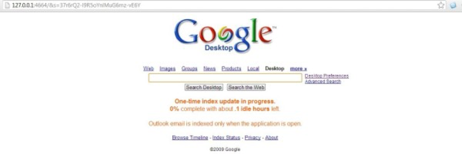

之前的几篇文章都是讲如何使用搜索引擎来检索互联网上的内容，一旦网络断开那些方法就都歇菜了。不少译员在平时学习和工作过程中会将很多跟自己专业相关的文档存储在自己的电脑中，所以往往需要去检索自己本地的文档。

技巧十二：本地文档检索

本地文档检索说白了就是到自己电脑上去找东西。
大家都知道在Windows操作系统的“开始”中就有一个搜索框，那为什么会有人专门为Windows操作系统开发本地检索工具呢？因为原来的不好用，至少我在用Windows自带的搜索工具时，等了半天才能看到我要找的文档，那种速度让人实在忍无可忍。

所以我发誓要介绍点有用的干货给大家，帮助大家脱离苦海。
工具一：速度最快的文件名搜索工具“Everything”

下载网址：http://www.voidtools.com/Everything-1.2.1.371.exe

就像名字里说的那样，这玩意儿能很快搜索文件名，据说 “百G硬盘几十万个文件，可以在几秒钟之内完成索引”，从我自用体验来看，搜索硬盘文件的速度快得难以置信。

我就不去吹这个工具有多牛了，大家下载下来，打开，过几分钟，然后去搜索一下你电脑里的文档，到底搜索结果是否令你满意，一搜便知，说太多都是虚的。

（中文支持：http://xbeta.info/everything/faq.htm ）

工具二：已经停止开发不再更新但依然强大的“Google桌面”

下载网址：http://vdisk.weibo.com/s/v-dIU

上面那个叫“Everything”的东东是用来搜文件名，除非你是一个非要给所有文件规规矩矩重命名的强迫症患者，假如你跟我一样平时不怎么去管理文件名，那么你明知道某个文件在自己电脑里，却不知道怎么才能找到它时，你得有多纠结呢？

“Google桌面”不但能搜文件名，还能搜文件中的内容。

但是，Google桌面的问题是：干的活儿多，吃得也多。安装完之后，它要花很长的时间去收集你本地硬盘里的文件信息，而且这个过程不但耗时长，电脑还会有点卡。我建议你在不做翻译的时候安装Google桌面，让他去收集信息。只要收集完了，用的时候就快了。

啊，怎么用？

如果你真这么问了，我就只好截个图给你，口说无凭啊：



上面这个截图显示的就是Google桌面的界面，也是在浏览器中打开的，但你输入检索词后，这玩意儿会去检索你本地硬盘里的文档内容（还可以在浏览器里预览文档内容哦~）