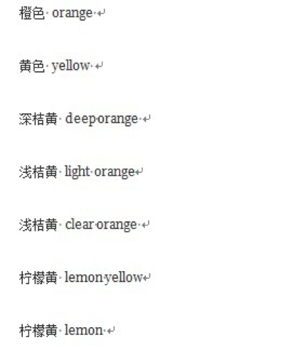
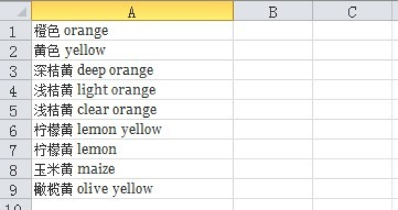
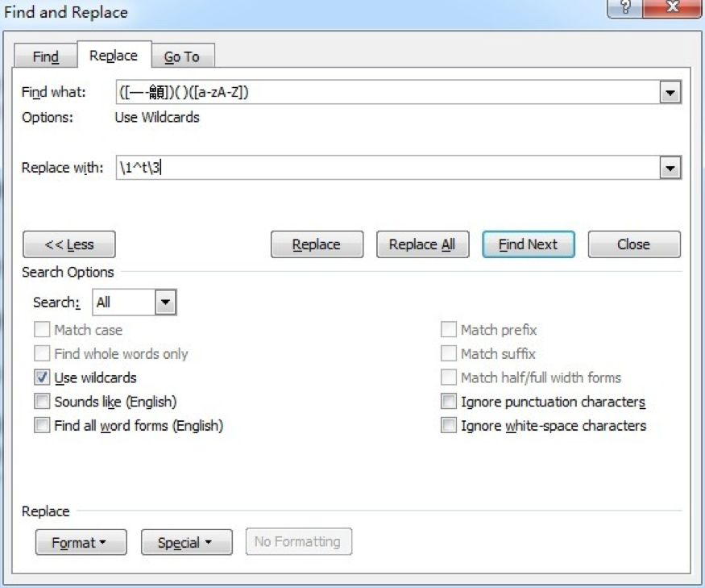
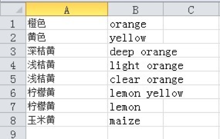
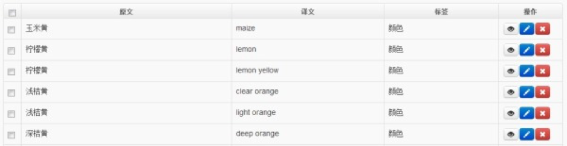

有位同学在整理术语时遇到一个问题：她想将手中的一个术语表上传到语帆术语宝中进行管理，但是发现他手中的术语都是这样的形式，如下图：



原文和译文之间都是用空格隔开的，而不是用制表符隔开的，这样的术语表粘贴到Excel中只能是这样：



原文和译文都挤在一个格子中，没法分别置于两列。

技巧十三：使用通配符选中所有中英文间的空格 

我给出的解决办法是这样的:

第一步：打开MS Word

将内容粘贴到Word中

第二步：查找替换

按“Ctrl+H”快捷键打开“查找和替换窗口”(Find and Replace)；

在上方的两个输入框中分别输入“([一-龥])( )([a-zA-Z])”和“\1^t\3”，并在下方选中“使用通配符”（Use wildcards），如图：



第三步：收工！

点击“替换全部”（Replace All）

第四步：上传到语帆术语宝

将文本粘贴回txt文档或Excel文档，如图：



上传到语帆术语宝中，如图：


