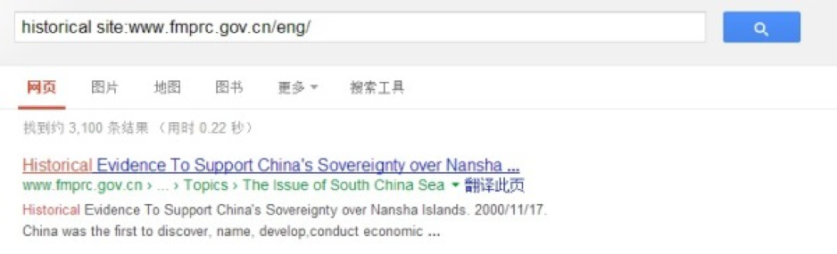

今天在一本词典用户交流群里，有一位群友问了这样一个问题：

“无历史依据”应该怎么翻?

对于这样一个问题，对于不少人来说可能一眼就知道答案。有位群友很快就回复了这个问题，将“历史依据”翻译成“historical basis”。

那么如果要去网上搜索“历史依据”的翻译方法，应该如何搜索呢？

我在这里提供一个我的搜索办法：

第一步：确定检索网站和检索技巧

当我听到“历史依据”这个词的时候，我脑海里首先想到的就是我国与其他周边国家的领土争端，一些外交辞令中似乎常常出现这个词，所以我想去外交部的网站上检索这个词。而使用的方法就是“site:”。

第二步：使用“site:”检索中文网站

我先用Google搜索了外交部的网站，然后在Google中输入关键词：

历史依据 site:www.fmprc.gov.cn

在第一条检索结果中，我发现外交部有一篇“政策文件”，名为：“中国对南沙群岛拥有主权的历史依据”
地址：http://www.fmprc.gov.cn/mfa_chn/ziliao_611306/tytj_611312/zcwj_611316/t10648.shtml

第三步：使用“site:”检索英文网站

一般情况下，这样的文章都是有英文版本的，所以接下来就是去外交部的英文网站检索英文的文章。

从外交部的中文网站中可以通过链接进入英文网站：http://www.fmprc.gov.cn/eng/

然后，我在Google中检索：

historical site:www.fmprc.gov.cn/eng/

得到的第一条检索结果是：



点击进入后，发现是之前找到的中文文章的英译文。由此可以确定，外交部官方的翻译方法是将“历史依据”翻译成“Historical Evidence”。

结论：

虽然我将整个过程分成了三步，大家看起来会觉得很繁琐，但是实际的过程只花费了不到半分钟，灵活使用这些检索技巧会让自己的工作更轻松。
