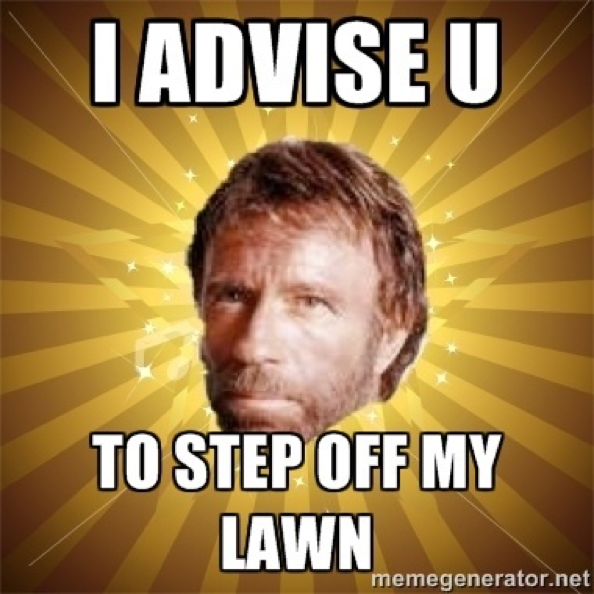
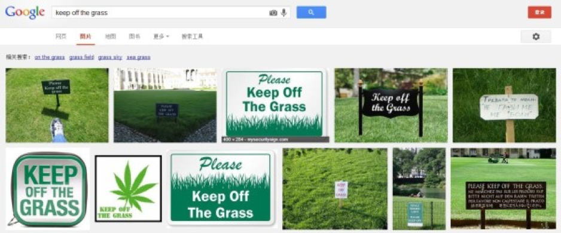

今天微博上有朋友讨论“小草有生命，足下请留青”这个标语的翻译方法。我给出的译文是：“Please Keep Off The Grass”，下面我就说一下我是如何通过搜索来得到这个译文的。

技巧十六：搜外国的公示语

我的出发点是这样的，既然是公示语，那就是公开出来给人看的，中文的公示语是给中国人看的，英语的公示语就是给外国朋友看的。

为了劝导公众不要践踏草坪，把中文写成“小草有生命，足下请留青”无可厚非，而且我们经常发现同一片草坪不同位置展示的标牌上都有不同内容的类似标识语。

但是，给外国人看的英文公示语，我认为应该先“直说”，再“拐弯说”。所谓“直说”，就是用国外在劝导人们不要进入草坪时普遍使用的公示语；而“拐弯说”则是指当国内所有的英文公示语都正确表达内容的时候，再发挥国人的想象力，用更委婉的英语来表达同样的意思。显然，我们还没有到“拐弯说”的地步。

那么，如果“直说”的话，怎么才能知道国外是怎么表达类似意思的呢？

第一步：打开Google，进入图片搜索：



第二步：先尝试搜索：lawn step off

在检索结果中，我们看到这样一张图片：



显然这不是“公示语”，而是“私示语”......

通过这三个词的关键词检索，我并没有发现那种“立在草坪旁的标牌”，所以继续尝试。

第三步：将lawn换成grass，再搜索：grass step off

我发现即便这样搜索，依然没有在结果中找到合适的结果。但是：

我发现Google给我提示了一个“相关搜索”，如下图所示：



第四步：我通过相关搜索的提示，进入“keep off the grass”：



各位看官，大家可以自行去检索这个短语，看看是不是也能搜索上面这些图片。

最终，我认为将“小草有生命，足下请留青”这个标语翻译成“Please Keep Off The Grass”。
