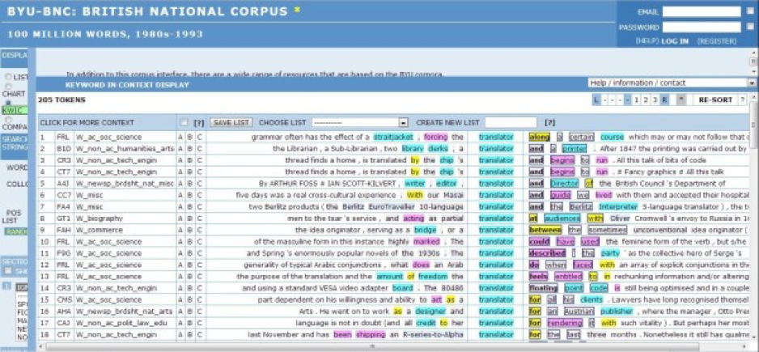

在上一篇文章中，我介绍绍兴文理学院的经典文学名著双语平行语料库，比如《红楼梦》汉英平行语料库。双语语料库在翻译过程中起到的作用非常巨大，能够直接为译员提供某个词或词组的对应译法。

既然有双语的语料库，自然肯定会有单语的语料库，这篇文章要介绍的就是国外的大型单语语料库。

技巧九：检索大型英语语料库

在检索时，译员查到几个例句，发现例句来源比较靠谱，一般情况下也就可以确定例句中的译法是可以采用的了。但是，真要遇上较真儿的人，这种方法就不可取了。尤其是在中译英的环境中，英文译文到底应该怎么用才是对的，可不是一两个例句就能决定的。

到底检索什么资源才能最靠谱呢？

BNC语料库是这篇文章的主角，从这个库建成以来，国内外围绕这个语料库的相关研究一把接一把。BNC的全称是：British National Corpus （英国国家语料库），大家可以访问Brighham Young University的Mark Davies教授创建的BYU-BNC网站：
http://corpus.byu.edu/bnc/

简单的说，这个语料库里包含了很多很多很多很多很多很多很多真实的英语语料，要想知道自己写的或说的英语是不是地道，某个词、词组、搭配是不是可以这样用，就可以到这里去。

这个语料库是英国国家语料库，Brigham Young University还建成了一个COCA语料库，全称是：Corpus of Cotemporary  American English（美国当代英语语料库）：
http://corpus.byu.edu/coca/

两个库的使用方法类似，因为功能太多，我就介绍其中的一个功能：KWIC（Key Word in Context），查询“translator”的效果如下图所示，不解释：



类似的国外大型语料库还有很多，我在这里需要补充一点的是，网上经常听到某位所谓的专家说：外国人不怎么用这个词、国外很少见到这样的说法，云云。

而到底那个词、那种说法外国人用不用不完全取决于专家怎么说，要通过语料库用事实来说话。

另外，有好几位好心的朋友在留言中提到让我多去参考一下李长栓老师在书中提到的搜索技巧，我必须要承认的是，李老师的书我都看过了，也确实参考了，有些东西他说了我还得说，有些东西他没说我也得说，他的书中并不是涵盖了所有的所谓的“高级搜索技巧”，所以，我还是有信心将这个系列的文章写下去的。