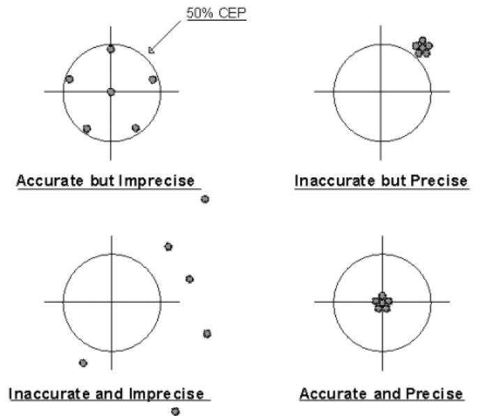

李开复在去年5月份的一条微博中强调“搜索能力”的重要性：

“多年前，“读写能力”是很关键的，有读写能力的人可以接触知识，传播想法。进入互联网时代后，“搜索能力”成为最关键的；这些人能有效地找到最有价值、最相关的信息。随着社交时代的来临，“社交网能力”变得更关键，那些能够经过虚拟人际关系和群众的智慧，得到信息、机会、人脉的人，有巨大的优势。”

这种“搜索能力”被很多人延伸成“搜商”的概念。

在翻译行业，去年也有不少人提到搜商，比如在去年的中国翻译联谊会上，自由译者娄东来强调译员要培养“搜商”，就是搜索到必要信息的能力。

有些翻译公司也看重这一点，译国译民公司的同事就提到，“现在做翻译，需要具备'搜商'。我们在公司培训翻译的时候，光搜索方面就要安排4个课时。”

记得前几天网上有人讨论Accurate和Precise的区别，我觉得可以用这个例子来描述一下对译员来说搜商高意味着什么：



（来源：http://weibo.com/1587303135/znrc4AmwT）

也就是说，译员在搜索信息时至少要达到“accurate and precise”，但是除此之外还需要加一条“quick”，即：译员搜商应至少达到：“quick, accurate and precise”的标准。

前面七篇文章一共介绍了八个技巧，这八个技巧的核心就是介绍如何在正确的网站使用正确的检索符选取正确的关键词进行检索。但是，面对网络上那么多的信息，这些还是不够的，使用这些技巧时一定要手眼快脑子快，在搜索过程中：

1. 快速决定检索思路，用中文还是用英文，选择什么关键词进行检索；
2. 得到检索结果后快速翻页；
3. 进入网页后快速浏览；
4. 找不到内容后快速换检索符合关键词。

至于怎样做到快，需要反复训练。

我在这篇文章中先抛一个砖：搜集国外哪些高校开设了“计算机辅助翻译课程”

近期我将录制一个视频，将我在网上检索这个问题的过程录制下来，同大家共享。对这个话题感兴趣的朋友不妨也去检索一下，看看在多长时间内能够搜集到多少学校。
